### June 27 - July 1, 2022

Received acoustic-trawl survey data through NOAA data warehouse -
103,245 observations. Data for 1980 - 2017 are included. I began by
creating a new dataset, `hake_df` that included only Pacific Hake
observations and relevant information (columns) - 93,186 observations.
Date information from the `eq_date` column were used, however,
observations with missing years were filled in using information from
`hb_date` column. This constituted only observations from year 2017.

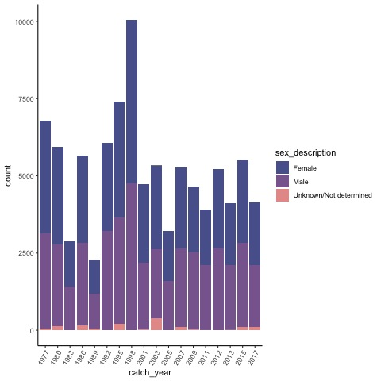

There are 46,816 female observations and 44,982 male observations. There
seems to be a fairly equivalent number of males vs females.


Looking more closely at growth, particularly the relationship between
length and weight, much of the unknown sex descriptions come from
smaller sized fish which makes sense. Females and Males seem to follow
very similar growth trends, as indicated by fitting separate growth
models to each sex and estimated coefficients being fairly similar.
Visually, there seems to be a greater abundance of females at those
larger sizes.

Because of the similarity between males and females and because males
and females are not modeled explicitly in the stock assessment, I went
ahead and continued modeling the sexes aggregated together. I did this
by first subsetting `hake_df` to observations that had complete length
and weight information `fit_hake_df` - 52,382 observations. I
log10-transformed the data (this was recommended over natural log
transformation), and fit a linear model using `lm()`, a least squares
method. The resulting model then became
$$log_{10}(W) = log_{10}(a) + b*log_{10}(L)$$.

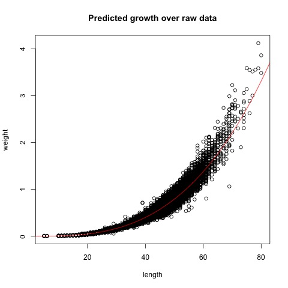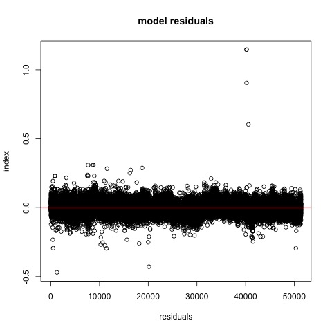

Above is the fitted model over the raw data and a plot of the residuals.
The multuple R-squared value of the fit is 0.9819, which means that 98%
of the variability can be explained by the model - which is great!

From now, I will be referring to residuals as growth anomalies (...
makes more sense in my brain). These next few plots will be exploring
patterns in growth anomalies as it relates to time, location, and age.

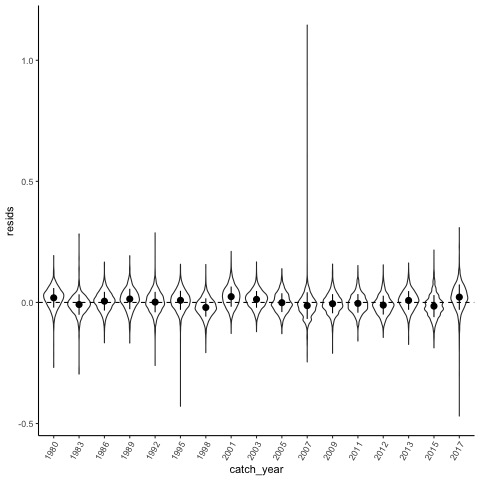

This first graph shows the variability in growth anomalies per year.
Immediately, you notice that 1995, 2007, and 2017 have considerable
variability in growth anomalies between individuals (i.e. there is a
wide distribution of individuals who are both larger and smaller than
normal). The distribution in 2007 is largely driven by 3 outliers, where
those outliers are small (length) individuals that are much heavier
(weight) than normal. I believe this may be due to measurement error.
Years 1995 and 2017 are years adjacent to record warm years (marine
heatwaves) which may have led to this variability in growth anomalies
due to differential responses between fish (spatial or perhaps age?).

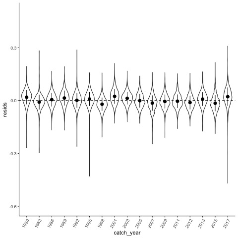

This plot removes the outliers from 2007. You can see that the 3
outliers really drive the distribution - how should we handle these
outliers?

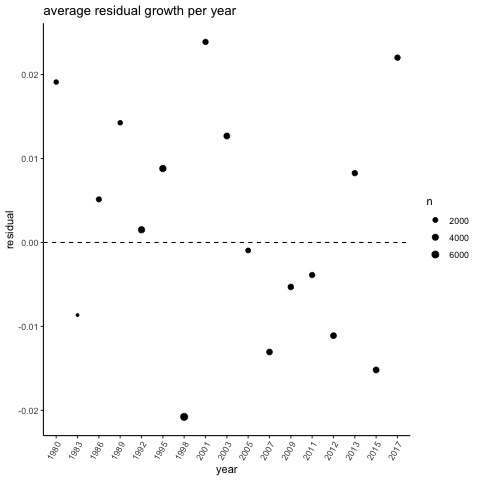

This plot is looking at the average growth anomalies per year without
the spread of data. It looks like many of the years prior to 2003 were
dominated by larger-than-avg individuals, except the year in which a
marine heatwave occured. Following 2003, many of the years are dominated
by smaller-than-avg individuals with the exception of 2013 and 2017.


This graph shows how growth anomalies vary along the west coast every
year. Values close to 0 (i.e. observed value is close to predicted - no
anomaly) are transparent for better visualization of + and - values.
Moreover, those 3 outliers in 2007 are included in the graph, but not in
the color scale limit, for improved visualization. You can see there is
considerable year-to-year variation, where in 1998 and 2015 you see
mostly smaller-than-avg fish all along the coast and aligns with the
years with marine heatwaves. In some years, there seems to be a slight
stratification, where the northern half of the coast shows larger or
smaller-than-avg individuals and southern half vice versa. An issue with
this graph is that you can't see individuals who do not exhibit a growth
anomaly, which I think would be valuable to see if this occurs in a part
of the coast.

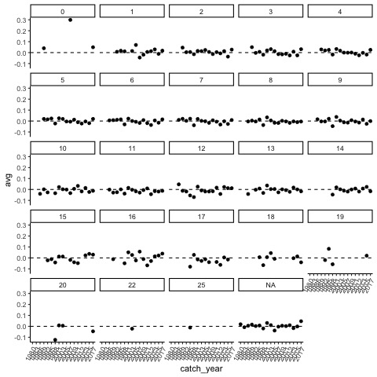

A time series of average growth anomalies per age group. This
essentially reveals how variable growth anomalies are per age - are some
ages more vulnerable to variation in growth? are some age classes
consistently larger or smaller than average? Either way, this plot is a
little hard to decipher.

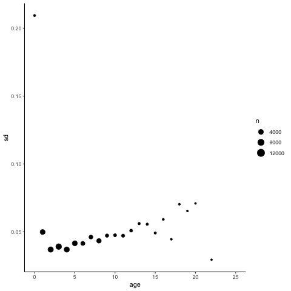

Summarizing the variability of growth anomalies per age even further, we
can see that growth anomalies are most variable at age 0 - likely
because there's fewer data and potentially greater measurement error -
and that variability in growth anomalies increases slightly with age.
However, there are fewer observations at those older age classes. I plan
to create a plus group, by concatenating the age classes 15+ as done
similarly in the stock assessment.

### July 4-8, 2022

Some next steps I plan to take this week is I will fit an age at length
model to assign ages that don't have values. I will create a plus group
age, grouping all ages 15 and greater. What sort of changes do we see
when we make this assumption? I will explore finer temporal resolution
to hopefully get an idea of some of the sampling/selectivity bias that
might be happening. Another question was whether there was spatial
variation in which sex dominates? All of this should then lead to some
statistical modeling to determine relative importance of the patterns
that I am seeing.

Okay, to start with estimating age using an length-at-age model, I first
subsetted the `hake_df` dataframe so that there is only complete cases
for age and length columns named `age_hake_df`. Then I added a new
column `new_age` which were ages including plus group (ages 15+)

I first fit a Von Bertalanffy model to the whole data (all years
combined), then fit a Von Bertalanffy model assuming "two regimes" where
I fit the model to years 1980-2003 and 2004-2017, and finally I fit a
Von Bertalanffy model to the plus group data.
$size \sim L_{\infty}/(1 + exp(-K * (age - t_0)))$

I selected the regimes by visually determining years with the most
similar average growth anomalies (1980-2003 had larger-than-avg
individuals and 2004-2017 had smaller-than-avg).

There was negligible differences in fit and coefficients between the
whole data scenario (RSS = 551852) and the plus group scenario (RSS =
551912). However, when the data was split into regimes the fit of the
model improved as indicated by the Residual Sum Squares (RSS =
324002/200280).

Overall, the fits didn't look so great - there was a bit of underfitting
over the age of 6. The graph below only shows fit for the whole data,
however, there were

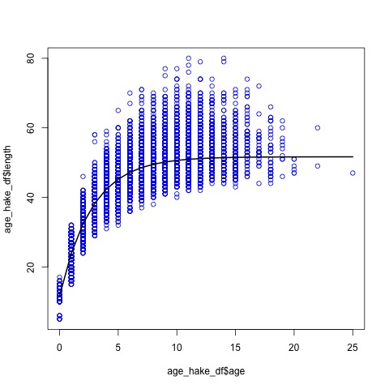

Because I created a plus group, I wanted to go back and look at some of
the data visualizations I did last week to see if there were any big
changes.

First, I looked at the variability in growth anomalies per age by
plotting the residual standard deviation for each age. The size and
color of the points indicate number of observations and whether the
residuals are positive on average (i.e. larger-than average),
respectively.

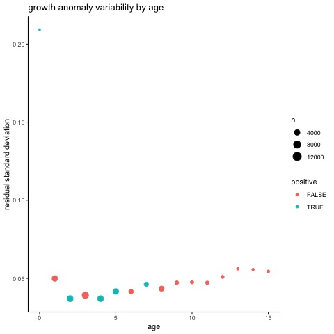

When estimating ages, it's worth making sure I understand what ages we
are estimating. Below is a rough length frequency plot by age, where
colors indicate age, and the grey line indicates observations that
haven't been assigned an age. A lot of the observations with unassigned
ages are larger individuals, and the VB models I have explored so far
underestimate the ages of those larger indivudals. How should I proceed?

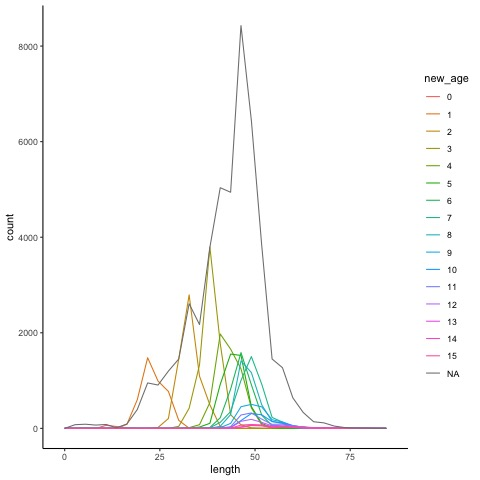

Looks like age 6+ are fairly similar lengths - increased potential for
mis-assigning these ages?

In terms of the stock assessment, the 2006 assessment modeled growth 3
ways: time-varying K, density dependent growth, and cohort-specific K.

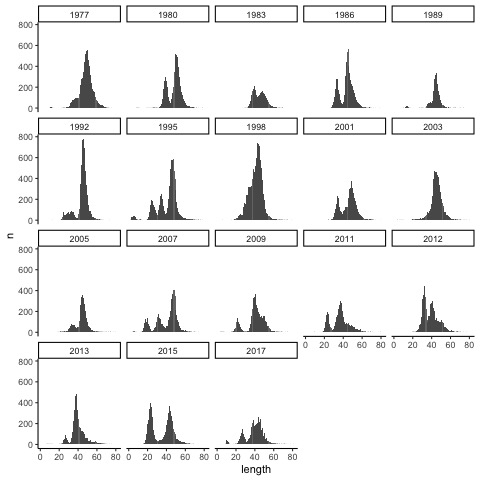

Notes from meeting with Kristin 7/7/22

-   The weight/age/year data may not be considered confidential and
    could request to get that data.
-   Interesting to look at spatial and temporal variation (check Maia
    Kapur's work).
-   Potential big-picture questions
    -   How can we leverage this information of growth anomalies? Are
        there cohort effects? Is there an effect on future spawning?
    -   Are there bigger recruitment events in years with fatter fish?
    -   Do fish that are fatter in the early lie stages, stay fatter
        throughout their life?
    -   Ultimately, how can we develop a model that goes into the MSE?
-   Next steps:
    -   Still have to explore finer temporal resolution
    -   hierarchical or mixed growth model with time varying K

### July 11-15, 2022

How do weight-length anomalies vary through time for a specific age?

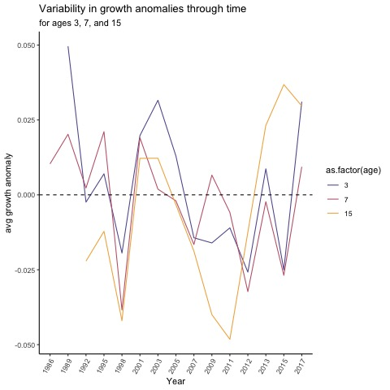

It looks like fish condition for a younger ages vary much more
stochastically compared to the plus group age that has much more
low-frequency fluctuations. Potentially because they aren't growing
quite as much at this age? Or lag effect with younger ages moving into
this plus group?

And similarly, looking at how cohort condition varies through time

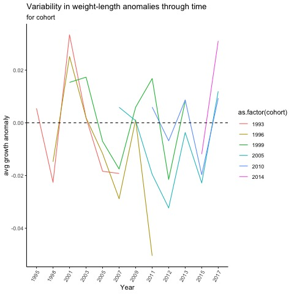

Doesn't look like there aren't too many patterns between cohorts.

-   **Meeting with Kelli Johnson (7/14/22) on weight at age**
    -   weighting process
        -   summarizes the data and then use that to weight things
        -   assumes all fish of the same age have the same weight
        -   only use individuals with ages when working with age
            composition and weight at age
        -   use individuals with length, weight, and age to groundtruth
            if needed
    -   data_wtatage()
        -   needs maturity ogive and catches to get mean weight at age.
            uses previous years to fill in missing age information
        -   assumes every population process going through SS uses the
            same weight at age (between different data sources - fishery
            vs survey vs etc)
        -   sampling date as potential covariates (do we need to take
            into account sampling month when we do weighting?)
        -   could model season (season just means month) but the caveat
            is that we need to fill in everything, and so that's just
            more estimating ages
        -   if the estimated ages look the same regardless if we add
            biological realism then who cares
        -   female only modeled
        -   ignoring this dilutes the potential that surveys/data
            sources are sampling different fish
        -   may need some way to fill in missing information better
            based on the results that we (kristin and i) find
            -   what if there's a regime shift but we don't account for
                that
            -   are there environmental covariates that may drive
                changes in weight at age?
        -   SS there's flexibility in how you want to fill in these
            values
        -   factors influencing weight at age
            -   sampling bias
            -   cohort effects
            -   environmental effects
        -   check how Pollock assessment fills in missing information
        -   Sablefish also has a lot of data to test on
        -   visualize weight at age over the raw data to see if there
            are strong cohorts coming through
        -   Line 157 in github code - beginning of where they fill in
            missing values
-   **Meeting with Kristin**
    -   random effects
        -   year
        -   cohort
        -   to establish cohort, we can create a cohort ID that is their
            birth year (cohort ID = current year - age) - We could also
            look at how growth anomalies relate to the size of the
            population or cohort to get into some density dependence
            effects
    -   3 potential ways to model weight at age
        -   random effect just on age
        -   gam (does brms have gams)
        -   boosted regression trees
            -   Doesn't give insight into mechanism, so might be
                difficult to translate into something for MSE
    -   For the growth anomaly variability line graph, we could also
        look at
        -   ages 1 and 2
        -   immature vs mature fish
        -   To think about: age 3 fish have fairly variable growth
            anomalies and they are also the biggest contributor to
            recruitment
            -   how does this variability affect population dynamics
    -   Note: big cohorts happened in 1999 and 2010

I tested out different GAMs using `gam()`, as well as running it in
`brms`.

1.  Simple GAM with no random effects

```{r, eval = FALSE}
gam_out <- gam(weight ~ s(new_age), data = hake_weight_age_df, method = "REML")
```

2.  GAM with group-level smoothers with different wiggliness for year

```{r, eval = FALSE}
gamm_out = gam(weight ~ s(new_age, bs="tp") +
      s(new_age, by = catch_year, m = 1, bs="tp") +
      s(catch_year, bs="re"), 
      data = hake_weight_age_df, method="REML")
```

3.  GAM with group-level smoothers with same wiggliness for year

```{r, eval = FALSE}
gamm_GS_out = gam(weight ~ s(new_age, m = 2) +
                 s(new_age, catch_year, bs="fs", m = 2), 
               data = hake_weight_age_df, method="REML")
```

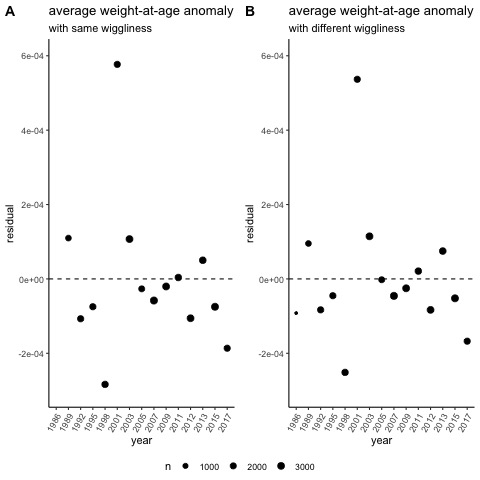

4.  GAM with group-level smoothers with different wiggliness for cohort

```{r, eval = FALSE}
gamm_cohort_out = gam(weight ~ s(new_age, bs="tp") +
                        s(new_age, by = cohort, m = 1, bs="tp") +
                        s(cohort, bs="re"), 
                      data = hake_weight_age_df, method="REML")
```

5.  GAM with group-level smoothers with same wiggliness for cohort

```{r, eval = FALSE}
gamm_GS_cohort_out = gam(weight ~ s(new_age, m = 2) +
                    s(new_age, cohort, bs="fs", m = 2), 
                  data = hake_weight_age_df, method="REML")
```

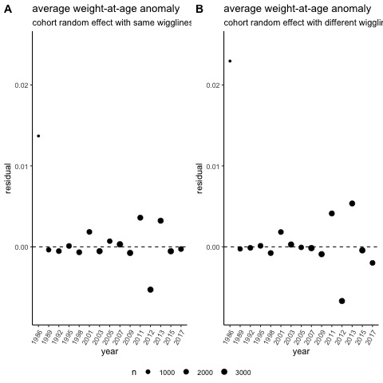

### July 18-22, 2022

Of all 5 models, `gamm_GS_cohort_out` had the smallest AIC value.

-   Notes on weight-length and weight-at-age and how they may relate
    -   weight-length relationships are indicative of "body condition"
    -   weight-at-age is a rate, so potentially indicative of growth
        rate

6.  GAM with group-level smoothers with same wiggliness for cohort and
    year

```{r, eval = FALSE}
gamm_GS_year_cohort_out = gam(weight ~ s(new_age, m = 2) +
                           s(new_age, cohort, bs="fs", m = 2) +
                           s(new_age, catch_year, bs="fs", m = 2) , 
                         data = hake_weight_age_df, method="REML")
```

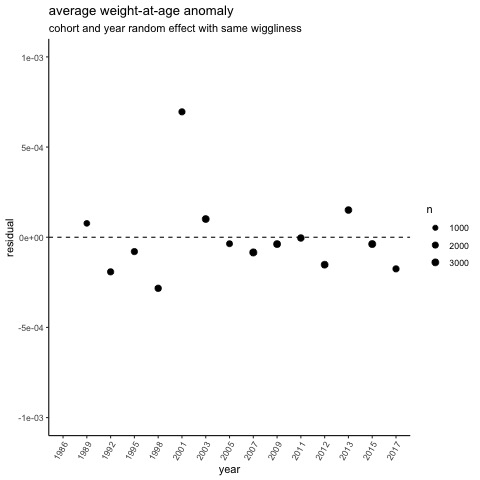

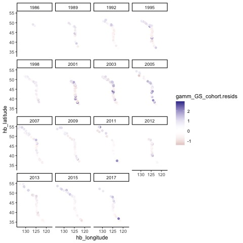{width="75%"}

Looking at how weight-at-age anomalies vary spatially by year, there
seems to be a lot more within year, spatial variation compared to
between years. This is in stark contrast from visualising the
length-weight relationship. This plot only shows for the gam model with
cohort RE and same wiggliness (model 5). However, there were no visual
differences between the other models that I tried (model 3 and 6).

Okay, I need a recap:

-   weight-length relationship
    -   greater year-to-year spatial variation
    -   plus group has lower freq variability through time vs younger
        ages are much more stochastic
    -   No clear pattern between cohorts when looking at weight-length
        variability through time
-   weight-at-age
    -   greater within-year spatial variation
    -   Different temporal trends in average growth anomaly depending on
        model used

Meeting with Kristin

-   gams
    -   don't put smoothers on random effect
-   year-to-year effects are better explained because the residuals are
    smaller
-   write down hypothesis about how weight-at-age should vary with
    cohorts or years
    -   different curve for each cohort
-   LOOIC instead of AIC (look at Michael Malick papers 2020)
-   Think about what I want to get out of the internship and make sure
    we're accomplishing that

### July 25-29, 2022

**Potential questions of interest**\
- Explore spatio-temporal patterns in growth of Pacific Hake\
- Identify potential covariates of growth trends and develop an
environmental index\
- Quantify the performance of incorporating an environmental index on
growth\
- Separately, test importance/sensitivity of SS of filling in missing
weight-at-age information assuming average vs environmentally driven
weight-at-age\
- Incorporate into the MSE?

**Goals for the rest of the summer**\
- Solidify motivation and guiding questions\
- Identify promising methods/approaches\
- Begin writing

This week I did more work on the gam modeling and now have a better
grasp on what I am modeling. Last week, the models I was fitting were
gam models with "random wiggliness" where each cohort and year had their
own wiggliness/spline action. However, we are more interested in random
effects where there is just a shift in the position of the curve
(intercept?), but the shape remains the same. With that in mind, I
realized we could still use the smoothing function (because smoothing
process also involves shrinkage and has a direct link to the shrinkage
involved in random effects) and specify `bs = 're'`.

I just tested a Bayesian GAMM with year and year+cohort random effects.

1.  Bayesian GAMM with only year RE

```{r, eval = FALSE}
gamm_year_brm_out = brm(bf(weight ~ s(new_age) + s(catch_year, bs="re")), 
                    data = hake_weight_age_df, family = gaussian(), cores = 4,
                    iter = 2000, warmup = 1000, chains = 4)
```

2.  Bayesian GAMM with year and cohort RE

```{r, eval = FALSE}
gamm_year_cohort_out = brm(bf(weight ~ s(new_age) + s(catch_year, bs="re")
                              + s(cohort, bs="re")), data = hake_weight_age_df, family = gaussian(), 
                           cores = 4, iter = 2000, warmup = 1000, chains = 4)
```

Model comparisons: elpd_diff se_diff gamm_year_cohort_out 0.0 0.0
gamm_year_brm_out -1632.4 110.9

Because the model with year + cohort RE was a better fit to the data, I
continue on only looking at that model

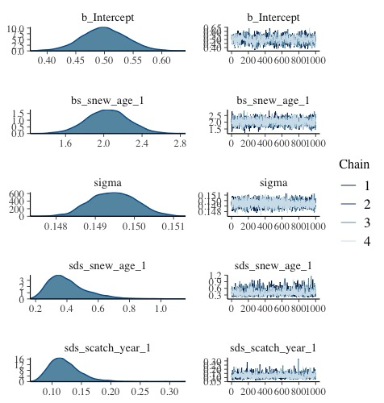
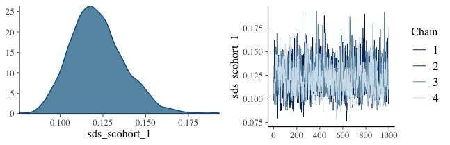

Density and traceplots look good - got the hairy caterpillars

However, the posterior predictive check doesn't look quite as good. This
plot shows the observed data (in dark blue) and simulations from the
joint posterior predictive distributions (in light blue). The replicated
data should align with the observed data, unless there is model misfit
or by chance. I used a gaussian distribution, however there is a bit of
a right skew and potentially a lognormal or gamma distribution might be
a better fit. I really have no clue what might be causing the
multi-modes though... thoughts?

Either way, the next few plots will be summaries of the coefficients.

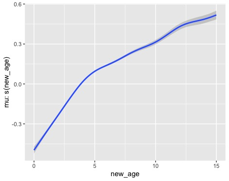

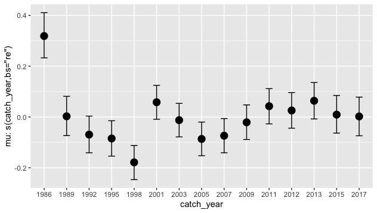

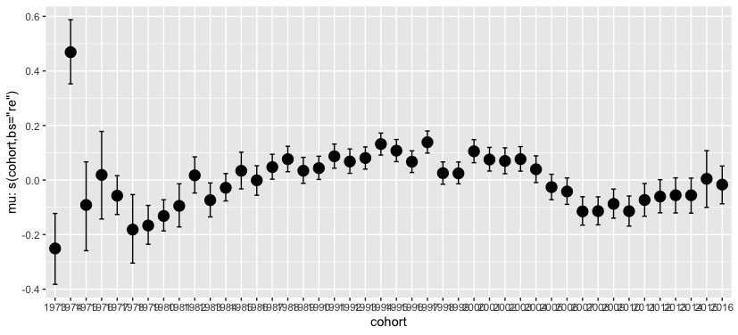

I am still trying to figure out how to graph these myself so that I can
customize the graphs, but for now these will do..

Very clear year and cohort effects, some with credible intervals not
passing over 0. Does that mean something like how it means in confidence
intervals?

**Questions**

-   How to best explore "year" and "cohort" effects - is just specifying
    random effects okay?
    -   are these effects important and how important are they relative
        to each other?
        -   have a model for each (no RE, just cohort, just year, both)
        -   look at sd for year vs cohort. which has more variability
-   where can I get recruitment and biomass information?

**Questions for presentation in hake meeting**

-   potential environmental covariates to explore linked to growth? What
    is available?\
-   spatio-temporal methods?
    -   sdm-TMB\
    -   gam with smoothers on lat,long\
-   thoughts on length-weight vs weight at age?\
-   Other assessments that use environmental indicators/indices that I
    can gain inspiration from?
-   proposed research questions

**Meeting with Kristin** ]

-   what makes weight at age different from recruitment? there is no
    real way to put an environmental driver into stock assessment since
    it is empirical
    -   rather, explore how incorporating an environmental driver
        affects the matrix of weight at age that does go into the
        assessment
    -   MSE: historical period using same empirical weight at age as
        estimation model, future assumes average weight at age (not a
        good assumption)
-   Fix assumed distribution in brms (lognormal/gamma)
-   does spatial matter? If not, then we can lump data together with
    fishery data and get a longer time series
    -   dig into smaller time-scale
-   Next steps
    -   model comparison
        -   add smoother on lat,long (start simple model with just
            weight at age no RE)
    -   identifying potential covariates
        -   temperature, upwelling, decadal?
-   recruitment and biomass information
    -   pacific hake mse github - assessment repository
    -   include as a potential driver

### Aug 1-5, 2022

**Notes from presentation**

-   Kelli: cohort effect of ageing error
    -   strong cohorts have more ageing error
        -   can lead to unequal smoothing
        -   smoother would be smoothing out ageing error?
        -   in stock synthesis, treat strong cohorts differently
    -   maybe add a cohort effect for large cohorts
    -   Kiva doesn't think it's that important (error in variables)
    -   Even if I don't include it in the model immediately, it could be
        a way to explain some of the results
-   For gamm with year and cohort random effect, there was agreement on
    the presence of autocorrelation in the cohort random effect
    -   perhaps above average weight at age carrying through
-   In terms of temporal trends, previous surveys were a different
    temporal window. If we could show that there are no differences in
    short timescale, then that's also good to know\
-   sdm-TMB - run all the models with and without spatial effects - get
    started on this (after looking into modes - next point)\
-   Figure out what those modes are in the observed weight data
    (pp_check) - are they ages 1,2, and 3?\
-   Motivations for population dynamics fellowship
    -   Lay the groundwork for what we might build into a forecast (so
        instead of interpolating, we can extrapolate)
    -   They want to include an internally estimate weight at age into
        FIMS, and so this work can directly inform how they do that

Fixed the distribution from gaussian to lognormal and re-ran the 4
models in brms. 1. Just age as a predictor\
2. age with catch_year random effect\
3. age with cohort random effect\
4. age with both catch_year and cohort random effect

The posterior predictive check is much better when using the lognormal
distribution, but there seems to be some bias in predictions as shown by
the offset peaks.

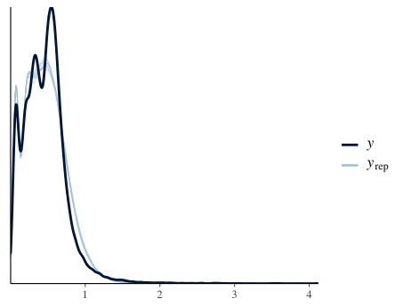

So, what are those peaks? Through some simple visualisation, it looks
like the peaks are associated with ages as opposed to cohorts. The first
peak is the age 1 individuals, the second peak is ages 2 and 3, and the
third peak is a compilation of the rest of the ages.

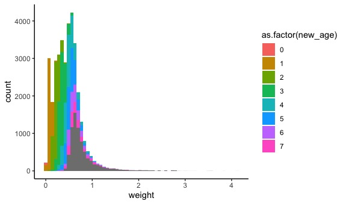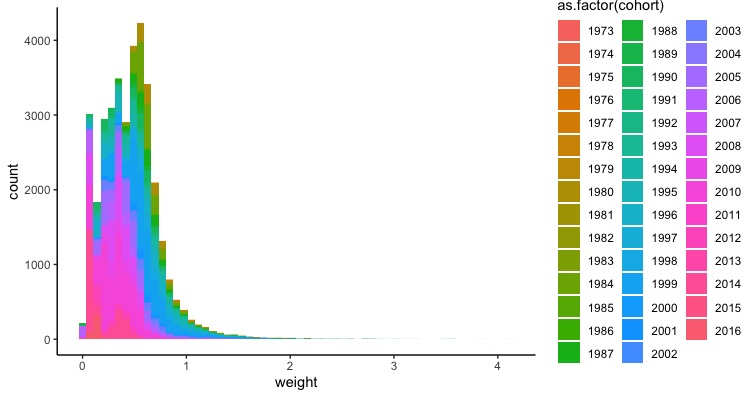

Now I am on a quest to minimize the bias!

I am instead running more gams in mgcv since that has been much faster.
In terms of the bias in the posterior predictive check, I originally
thought a gamma distribution might be a better fit than the lognormal,
but that doesn't seem to be the case when I looked at the outputs and
GCV which is a leave one out cross-validation that acts similarly to the
AIC. So, I continue to use a lognormal (or at least in the gam case, I
am using a gaussian with log link - which hopefully is fine... couldn't
find the lognormal distribution option in mgcv)

I also included a smoother on latitude to hopefully capture some of the
residuals in the larger fish. Below is a plot of the partial effects for
the gam with catch_year random effects, s(cohort), and s(latitude) and
you can see the new_age is still underpredicting for those older ages

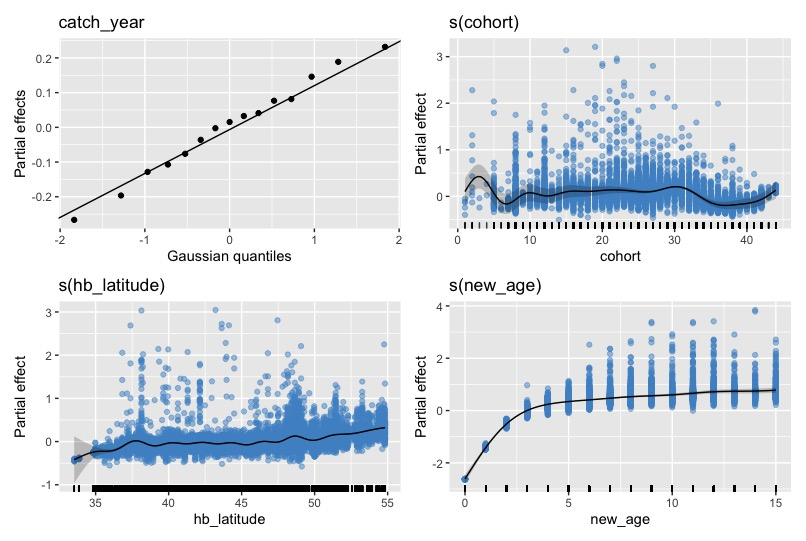

I also learned about new diagnostic checks using `gam.check` to
determine if the number of knots is too low (predictors with k \> 1 or a
significant p-value)

### Aug 8-13, 2022

Following the gams fit last week and the significance of at least a
smoother on latitude, I am making the switch to sdm-TMB and going to
start figuring out how to use it.

-   check correlation structure

Notes on coordinate system for sdmTMB

-   have to convert from LatLong to UTM which minimizes distortion and
    has attributes that make estimating distances easy and more
    accurate.\
-   Pacific Northwest is UTM zone 10 (EPSG: 32610)

**I was on vacation from Thursday - Monday**

### Aug 16-19, 2022

The first thing I did was check correlation structure among key
predictors from the data frame which included catch month, catch day,
length, distance fished, latitude, longitude, catch year and cohort.
Using the `cor()` function, there were a few correlations \> 0.7.

-   latitude x catch month = 0.80\
-   latitude x longitude = 0.85\
-   cohort x catch year = 0.94

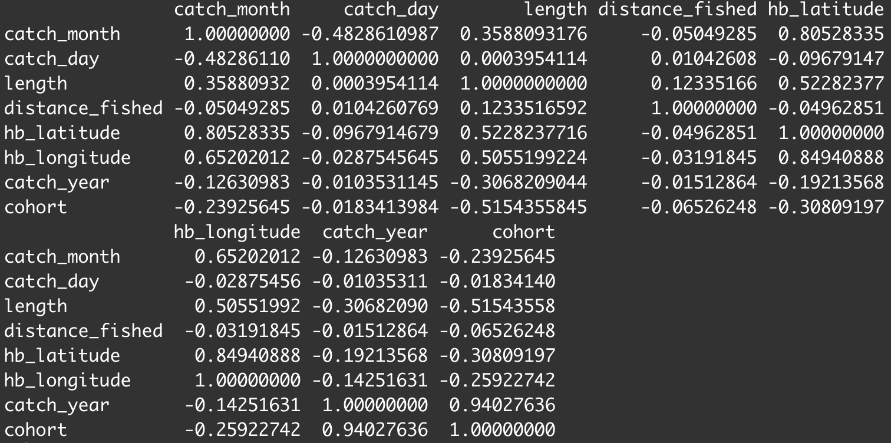

*Big picture thinking*

1.  What are the local and regional trends in weight at age of Pacific
    Hake
2.  Which covariates explain these changes and in what direction do they
    covary?\
3.  How strong are the latent spatial and spatiotemporal random effects?
    (maybe don't explicitly say this, but good to include in results)\
4.  To what extent does incorporating growth variation into the
    interpolation of missing data within the stock assessment affect the
    estimationg of management reference points?

Things to remember

-   the data that I have is limited to the months of June - September
    when the acoustic trawl survey is sampling.

Variability can be partitioned into 4 ways (larsen et al 2001 - Designs
for evaluating local and regional scale trends):

-   Spatial: areas with increased condition in all years\
-   Temporal: changes throughout the populations range in a given year\
-   Spatiotemporal: areas with increased condition in a particular year\
-   Individual: residual variation in condition for each individual

*Covariates to consider*

-   Temperature (at depth? SST?), PDO, ENSO (abiotic)\
-   Main food source (Euphasiid) or predator or competition from strong
    year classes (biotic)\
-   total catch? (fishing)

*Questions for meeting with Kristin*

-   Do I need to standardize the data according to the CPUE? Saw this in
    the body condition sdmTMB paper - might just be for density model\
-   Were there any changes in the net used for the acoustic-trawl survey
    that might influence the size of the fish being caught?
    Vessel-specific variation from year to year as well...\
-   Should we start to look into obtaining environmental data?\
    -biomass at age for strong year classes

*Explorations with sdmTMB*

I am getting the hang of it. I started off with a very simple,
non-spatial model where weight is predicted by age and cohort, with age
and cohort as have a smoothing function. Then I turned on spatial, then
the spatiotemporal random effect with an AR1 process. I tested two
spatiotemporal models

`m2: weight ~ s(age) + s(cohort)`

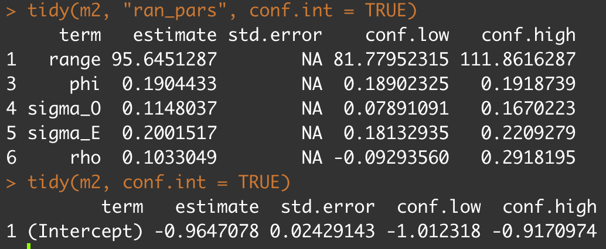 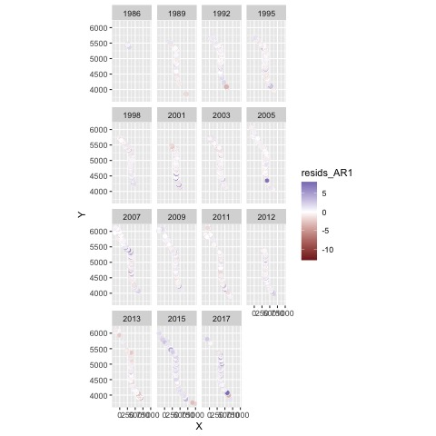

`m3: weight ~ s(age) + s(cohort) + catch_month`

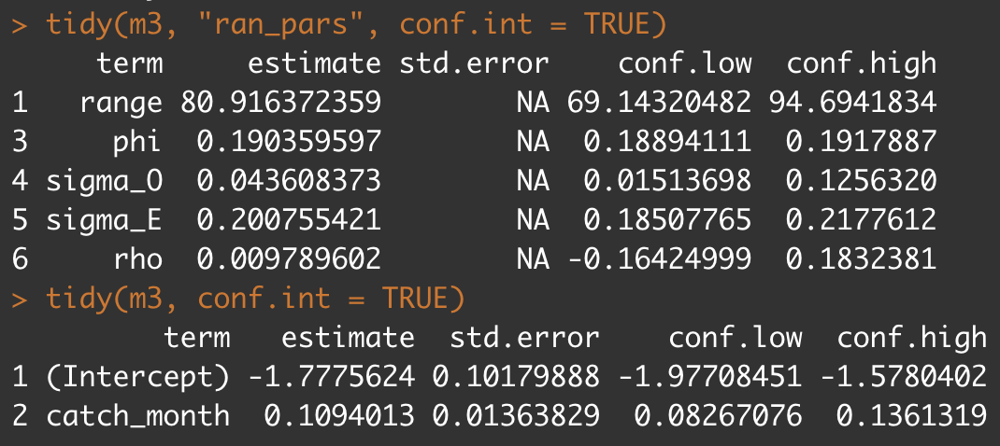 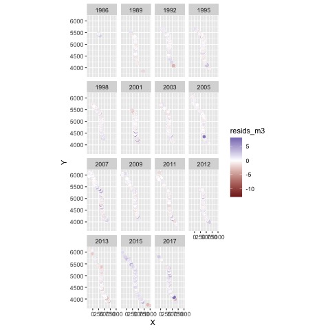

Catch month and latitude have a correlation of 0.8. Is it fine to still
include if latitude is not considered a predictor, but rather a spatial
random effect?

In terms of autocorrelation, I realize I never really looked at the time
series of weight for each age to see if there are any long term declines
or where the variability is most prominent.


There also seems to be some differences when we split the data between
north and south at the median point. UTC 4957.963

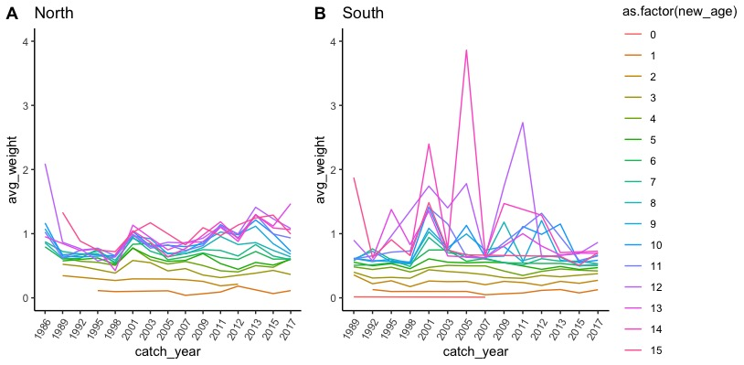

There is much greater variability in the older age classes of the south.
Moreover, there may be a slightly increasing trend in the north.

Definitely worth looking at a longer time series of this - where is the
fishery data again?

Now looking at the outputs of m3

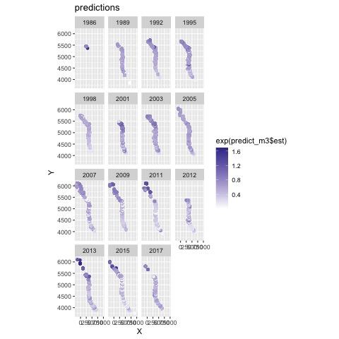
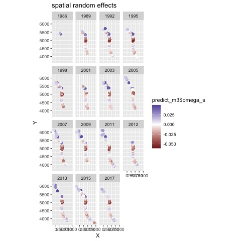
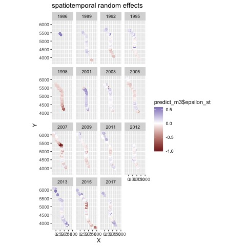

Next week:

-   time varying intercept model and compare to gams\
-   add a smoother on catch_year\
-   biomass of cohort in that year rather than cohort

### Aug 22-29, 2022

There are a few ways to include time-varying intercepts

-   as.factor(year) I tried this and the model didn't converge very
    well\
-   (1 \| year) I tried this as well and the model didn't converge very
    well\
-   time_varying = \~ 1 This one worked the best. It follows a random
    walk

`m4 = weight ~ 0 + s(new_age) + s(cohort) + catch_month with time-varying intercept`

However, it doesn't look like it improved the residuals very much...

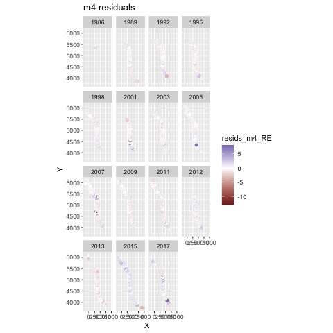

Could it be that one of the predictors is time-varying rather than the
intercept?

I also tried including a smoother on catch_year in addition to the
time-varying intercept and that doesn't seem to capture the differences
in weight in 2013-2015

`m5 = weight ~ 0 + s(new_age) + s(cohort) + catch_month + s(catch_year) with a time-varying intercept`

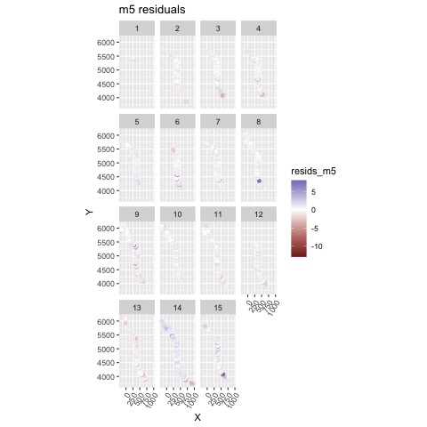

Also tried a model that didn't include a smoother on catch year but
instead created a separate slope for the smoother on new_age. I did this
because I was hoping to capture the variability in more recent years
that we saw in the observed weight at age in the north above.

Potentially include age as a time-varying slope to account for the
changes in weight at age in more recent years? unfortunately can't
include smoothers in the time-varying argument, but instead can use
independent slopes for each year s(new_age, by = catch_year)

`m6 = weight ~ 0 + s(new_age, by = catch_year)  + s(cohort) + catch_month with time-varying intercept`

This model did not converge (non-positive Hessian definite)

Tried removing the smoother on cohort,

`m7 =  weight ~ 0 + s(new_age, by = catch_year) + catch_month with time-varying intercept`

This model converged, but it still doesn't capture the residuals in the
more recent years.

Also, realized the maximum residual is "Inf". I just don't think any of
these models are doing too well, so I am stepping back and looking at
the data once again.

This first plot is weight at age curves by year. and the next one is
just for the northern individuals.

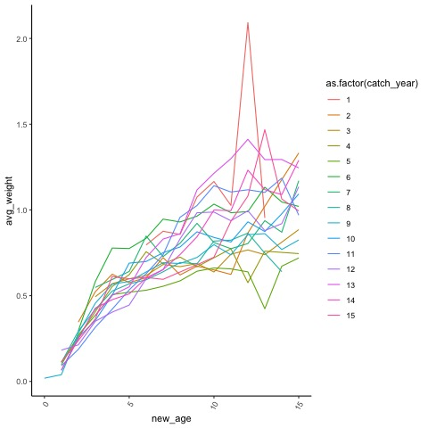

Then, by cohort

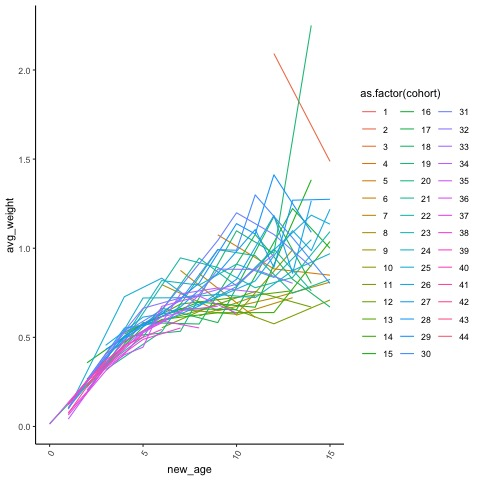

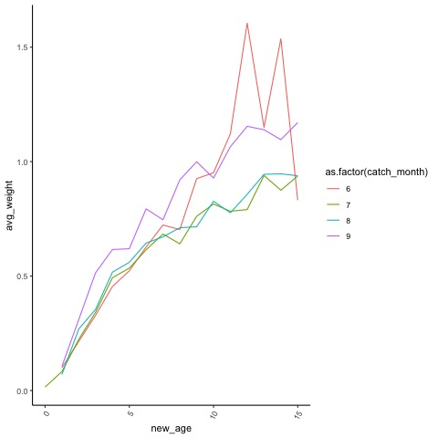 But as a caveat,
here are how many observations of each age are sampled per month. Month
6 and 9 are very lightly sampled, so take with caution.

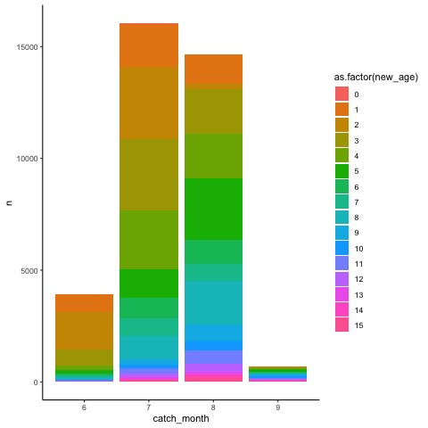

`m8 = weight ~ s(new_age, by = catch_year)` Just spatial (not
spatiotemporal)

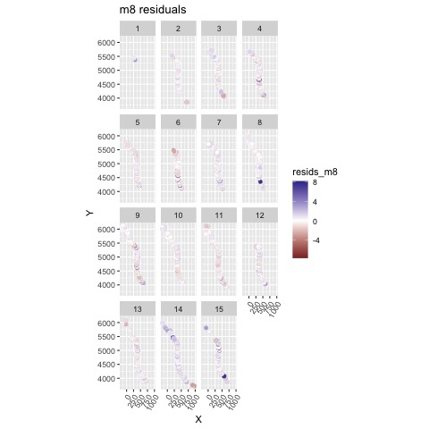

Okay, but even simpler, the spatial model with `weight ~ new_age` seems
to minimize the residuals quite a bit.

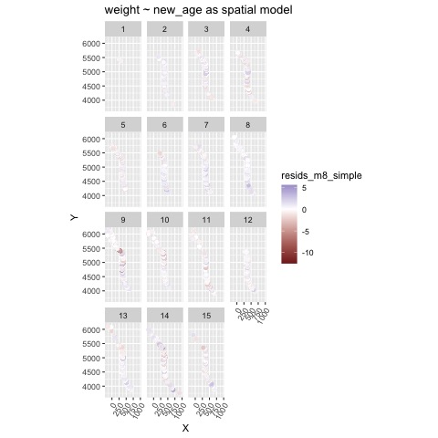

*Meeting with Kristin*\
- catch_month currently is a fixed linear effect, but the data tell us
otherwise. Maybe best to consider it as a random effect\
- Does it need the spatial part or the spatiotemporal part or either? -
what are the temporal trends and potential covariates (qualitatively)\
- standard deviation of the catch month random effect vs intercept, vs
others to see how much those matter compared to the spatiotemporal.\
- try to fit catch_month random effect, and then add the time-varying
(but potentially confounded)\
- sub-areas within a region - weight-at-age curve for canadian vs US\
- fishery data - can't fit spatial model, but we know that the canadian
fishery fishes in canada and the us fishery fishes in US, so we can at
least have that spatial component (which for the MSE is relevant)\
- malick - relationships with temperature.

### Sept 12-16, 2022

Prior to this week, I have settled on a model
`weight ~ 0 + s(new_age) + s(cohort) + (1 | catch_month) + (1 | catch_year)`
and have tried three versions: spatiotemporal, spatial, and without
random fields.

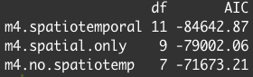

According to AIC, the spatiotemporal model was the best model. It also
converged very nicely.

*Questions for Kristin*

1.  how to make a mesh over the survey area?

-   plot the random effect levels for the catch_month -github action
    knit rmarkdown

### Sept 19-23, 2022

Trying to learn how to create a spatial domain, following code that
Malick provided (in the `malick_code` folder of the project).


I was able to make a spatial domain following Michael Malick's code,
however, when I go to make predictions on those new data, an error pops
up saying

Error in vapply(RE_names, function(x) as.integer(nd[[x]]) - 1L, rep(1L,
: values must be length 4575, but FUN(X[[1]]) result is length 0

I tried reformatting the dataset, making sure that the UTM coordinates
were aligned and that time was modeled (i.e. can't be considered as a
factor class). Not entirely sure what else it could be. Either way,
decided to continue making maps using the observed datapoints.

Because time needed to be modeled (not considered a factor class), I had
to restructure my model. It still had spatial and spatiotemporal random
effects.

`weight ~ 0 + s(new_age) + s(cohort) + (1 | catch_month)` with
time-varying intercept (\~ 1) following a random walk.

I overlayed some of the predictions over the map of the coastline and
some interesting patterns arise, especially with spatial random effects.

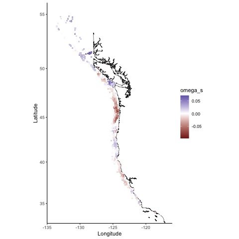

There is a very interesting spatial trend! It looks like the hake are
lighter than average in areas nearby where freshwater meets the ocean
(columbia river basin and san joaquin river basin) and a patch of
heavier than average hake at the entrance (or exit?) of the strait of
juan de fuca. Through quick search, it looks like there is a patch of
greater primary productivity at the entrance of the strait of juan de
fuca similar to where we see the patch of heavier than average fish
(Davis, K. A., N. S. Banas, S. N. Giddings,S. A. Siedlecki, P.
MacCready,E. J. Lessard, R. M. Kudela, andB. M. Hickey (2014),
Estuary-enhanced upwelling of marine nutrients fuels coastal
productivity in the U.S. Pacific Northwest, J. Geophys. Res. Oceans,119,
8778--8799)

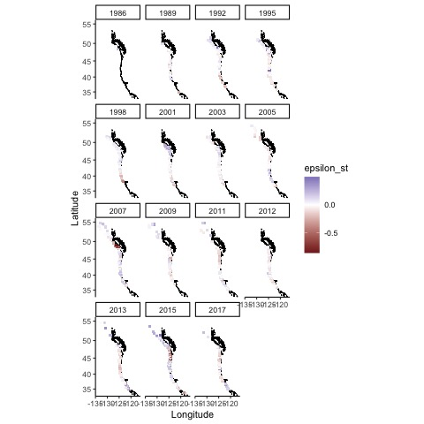

### Sept 26-30, 2022

Looking at the time-varying intercepts, there is quite a clear temporal
trend revealing pacific hake are becoming heavier than average! The
information on temperature anomaly is pulled from Malick et al. (2020).
The trend doesn't appear to be strongly tied to temperature, at least
when visualized this way.

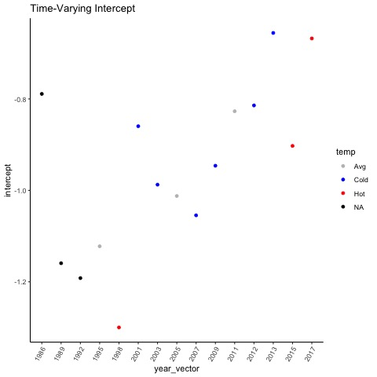

Malick et al. 2020 looked at whether the relationship between
temperature and biomass remained stationary across life stages by
splitting the data up into 3 age groups (age 2, 3-4, and 5+) and running
the statistical model. Potentially something I can do...

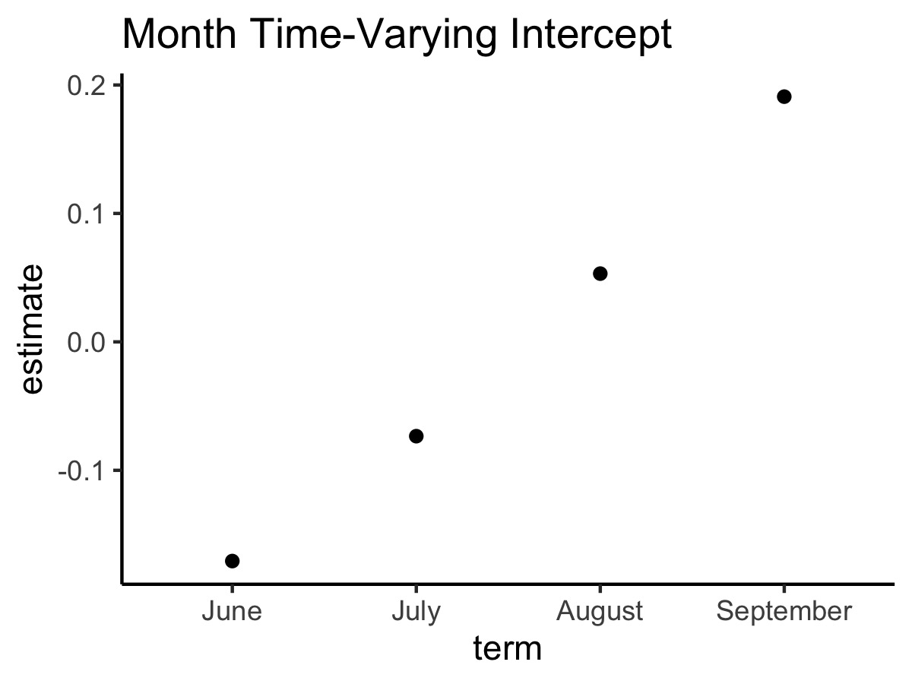

When looking at the varying intercepts associated with month, there
seems to be a linear increase according to the model. Previously, when
just visualizing the data, there was a nonlinear trend in weight at age
between months so we decided to treat catch_month as a random effect.
This could be the result of uneven sample sizes which is accounted for
as a random effect in the sdmTMB model. Might be worth switching cohort
back to being a linear effect.

*GAMS*

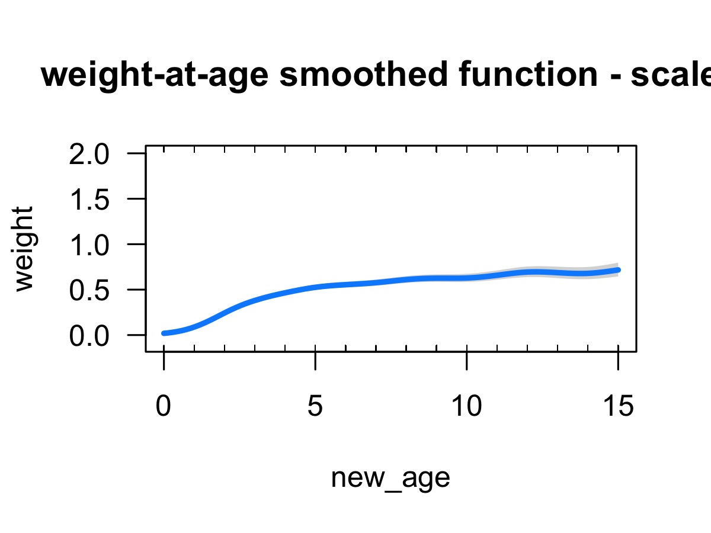
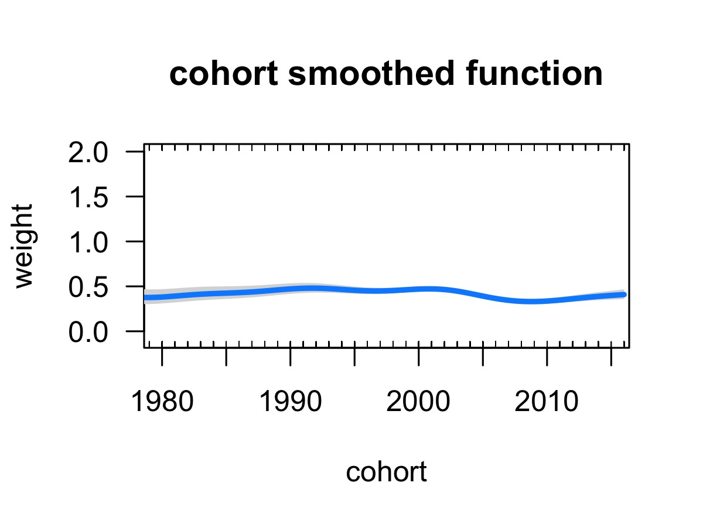

The linear component of age is positive (\~ 20) and the linear component
of cohort is negative (\~ -5). With age, that checks out (weight should
be positively associated with age), but it seems as though there is a
negative trend with cohorts - so more recent cohorts are trending
lighter than average when compared to previous cohorts. This is
interesting to think about in conjunction with the time-varying
intercept, where hake are trending heavier than average through the
time-series. However, there is greater uncertainty in more recent
cohorts because of fewer years available to estimate weight-at-age. The
standard deviation of the weights for each smoothing function is greater
for age than for cohort, which I interpret as the extent of wiggliness.

After realizing that catch_month is has a linear effect on weight, I
reran the model with catch_month as a linear predictor
`weight ~ 0 + s(new_age) + s(cohort) + catch_month` with time varying
intercept. I ran two versions of this model: spatial + spatiotemporal
(m4.2) and just spatiotemporal (no spatial; m4.3). I did this because
the spatial standard deviation (omega_s) was fairly low compared to the
spatiotemporal standard deviation (epsilon_st) and one of the vignettes
mentioned not to run a spatial model when the spatiotemporal SD was much
larger than the spatial SD. When I ran those two new models, the AIC
indicated that m4.2 was the best model, m4.3 was \<1 AIC value larger so
there wasn't too much of a difference butthis model had a few errors
when looking at model diagnostics. The original model I was using where
catch_month was a random effect was \~15 AIC values greater than the
other models.

The only change that occurred in the outputs/coefficients when switching
catch_month to a linear predictor was that the coefficient values for
the time-varying intercepts shifted to smaller numbers, but the trend
remained the same. Everything else remained the same and instead
catch_month has a linear effect of 0.13.

*Things to remember*\
- Cohort effects - is there density dependence? i.e. in years with high
recruitment and consequently more compeitition for resources, do those
cohorts remain lighter than average?\
- Pacific Hake also have spatial structure (larger, older fish travel
more northward) - be mindful of how that might influence what we see. Is
that captured in the spatial sd? or in catch_month (which is associated
with space because sampling occurs more northward each month)

Model Validation? - AIC - well-documented biases with mixed effects
models - k-fold cross validation
(<https://pbs-assess.github.io/sdmTMB/articles/cross-validation.html>) -
tmbstan package to sample from joint posterior, evaluate accuracy of
laplace approximation or perform posterior predictive checks -
residuals: MCMC avoids statistical issues but is slower -
simulate.sdmTMB() can simulate from fitted models and sdmTMB_simulate()
can simulate entirely new data to ensure identifiability, evaluate bias
and precision in estimates, or evaluate consequences of model
misspecification.

There are also codes for each ship that sampled. It looks like there are
6 unique ship codes. Might be worth including ship_code as a covariate
to account for ship-ship variation?

In terms of predicting over the spatial domain, the reason it is not
working right now is because each spatial coordinate is being predicted
by all of the years, months, cohorts, and ages. What might need to be
done is instead figure out potential drivers for spatial variation which
could be included into the model, so the predictors only have one value
at each spatial coordinate.

*Notes for Meeting with Kristin* - negative time-varying intercepts -
Intro to sdmTMB vignette also has time-varying coefficients that are all
negative. I also kinda wonder if this has something to do with how they
are calculated. In the output, it shows `(Intercept)-1991` as the
parameter name, so is it subtracting from the "current" year? -
Originally I have the intercept as a time-varying parameter (random
walk), but I tried other ways to vary the intercept -
`as.factor(catch_year)` (i.e. IID) - did not converge -
`(1 | catch_year)` random effect

When we assume catch_year is a random effect

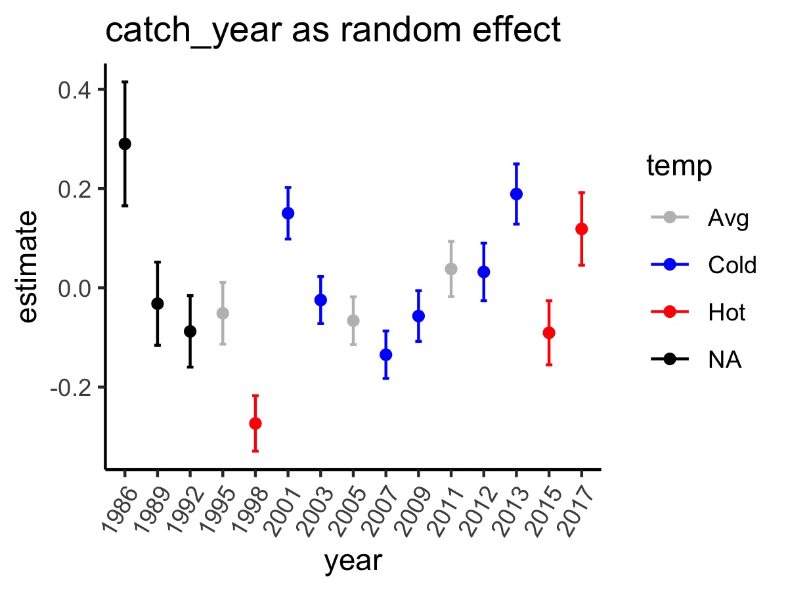

So, I think the question is, should we assume time as a random effect or
as a random walk? The reason why I switched to time as a random walk is
because in order to make predictions, "time needs to be modeled" (i.e.
not a random effect)

For the GAMs, I scaled them according to the response variable "weight"
because I thought that would be easier to interpret. Below are both the
scaled and unscaled GAM plots. I reran these plots using the newest
model with catch_year as a random effect

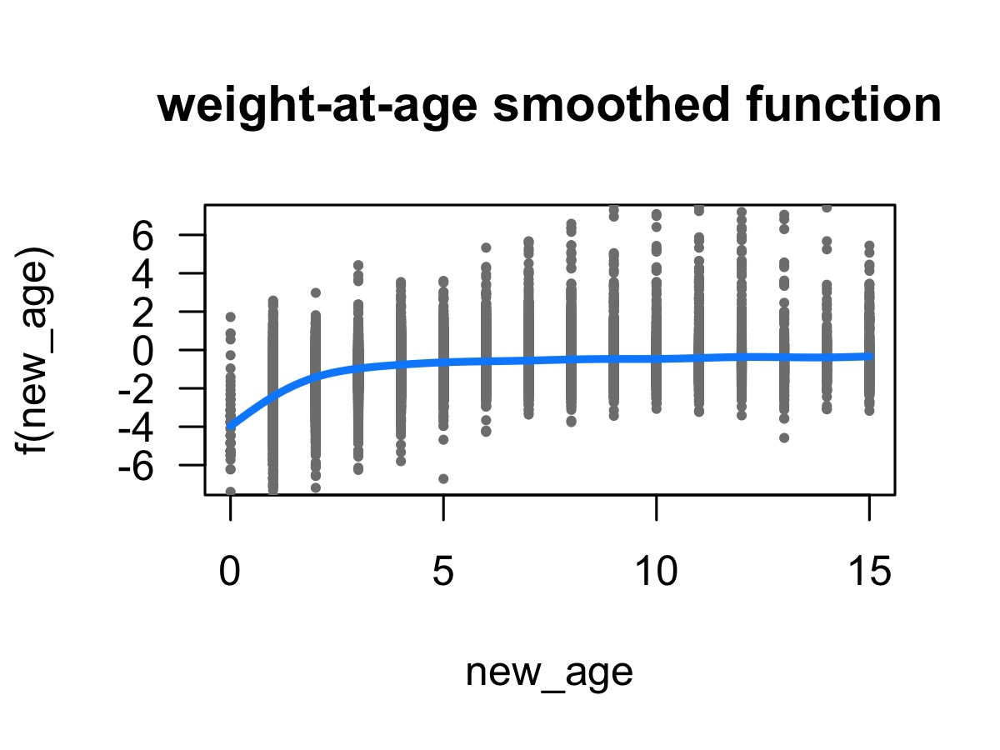


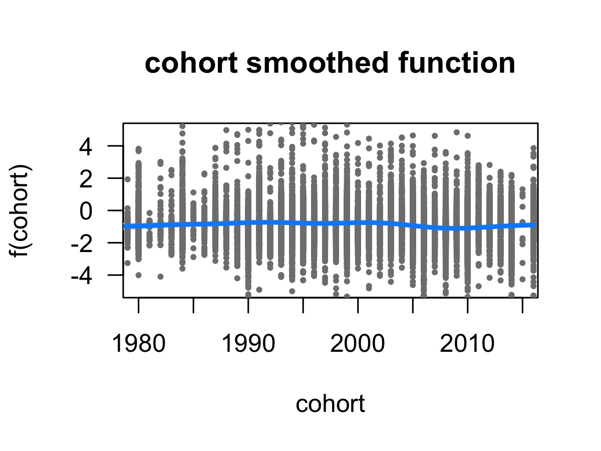

### Oct. 24-28, 2022

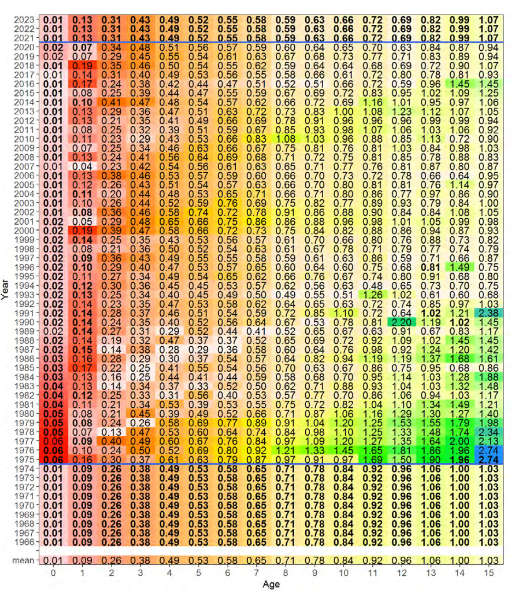

This is a clear example of the sensitivity of weight at age matrix to
the data quality used to generate it. The opaqueness of the colors
indicate the relative size, such that more translucent fish are lighter
than those more intense colors. In those early years (late 70s), the
matrix indicates the weight at each age are relatively heavier than
recent years. HOWEVER, this is a direct result of the sampling that
occurred in that year (primarily speaking about 1976 survey). The
sampling occurred largely in northern Washington and Canada, where my
preliminary spatial exploration of weight trends indicates is where
heavier hake tend to reside. This leads to an overestimation of weight
at age for those years and the surrounding ages and years where missing
data are interpolated.

### Nov. 2022 - Jan 2023

During this time I was working on the NMFS-SG Joint Fellowship
Application

### Feb. 2023 - Jul. 2023

During this time I was focusing on my Qualifying Exam and Chapter 1 of
my dissertation

I was then awarded the NMFS-SG Fellowship!

### August 2023

*Notes from meeting with Kristin 08/02/23*

-   Something to consider: Having age, year, and cohort within the same
    model may be confounding. Might need to pick just 2 covariates since
    cohort is a function of age and year.\
-   Next Steps:
    -   Run models with age as a required covariate (because we are
        dealing with weight-at-age) paired with either cohort or year.
        Do this without spatial or spatiotemporal random effects.
        Determine best fit model
    -   Add spatial and/or spatiotemporal random effects to the best
        model.
-   Still waiting on data from more recent years and the
    fishery-dependent data. Kristin is putting in a request for that.
-   Thoughts on PICES presentation
    -   3 solid results figures
    -   What's next - could be discussed as part of context or at the
        end
    -   Think about environmental covariates

I continued to work in the sdm-TMB.r script. I created a new section
titled **Pairwise covariate model exploration** where I begin the model
exploration Kristin and I spoke about (see notes above).

I am starting out with 3 main model configurations before incorporating
the spatial and spatiotemporal random effects. This includes:

1.  m_age \<- weight \~ s(age)
2.  m_age_cohort \<- weight \~ s(age) + cohort
3.  m_age_year \<- weight \~ s(age) + year

For model 1, I tested the fit to a lognormal link log and a gamma link
log. The lognormal link log was a better fit according to AIC which was
the case in previous model iterations.

For model 2, I tested the fit with a smoother on cohort and cohort as a
random effect. The random effect model was a better fit according to AIC
(\>3000). However, to me it makes more sense to have cohort as a
smoother since the effect on cohort one year to the next might be
correlated? Not sure. Maybe this data doesn't support that.


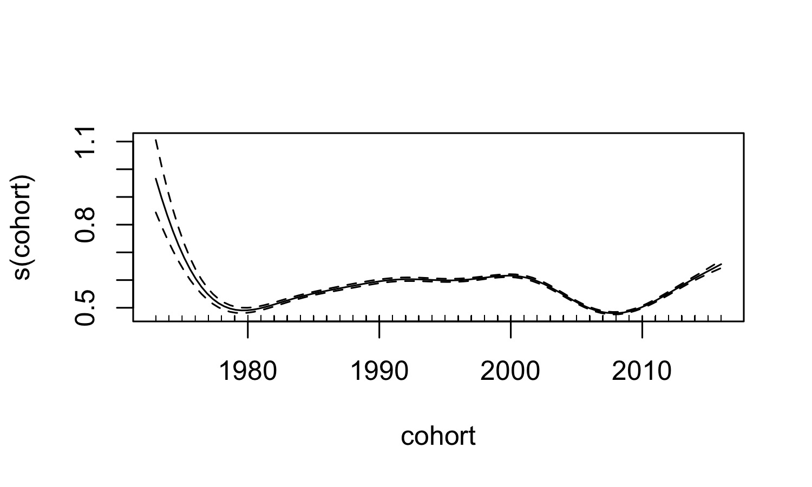

For model 3, I tested the fit with year as a random effect and as a
random walk. The random effect model was a slightly better fit (5 AIC).
However, I recieved a warning saying the models were not all fitted to
the same number of observations. Couldn't quite figure out why that may
be. It has to do with the year as random walk model and could
potentially be because the random walk interpolates into the "extra
time" (i.e years without data)

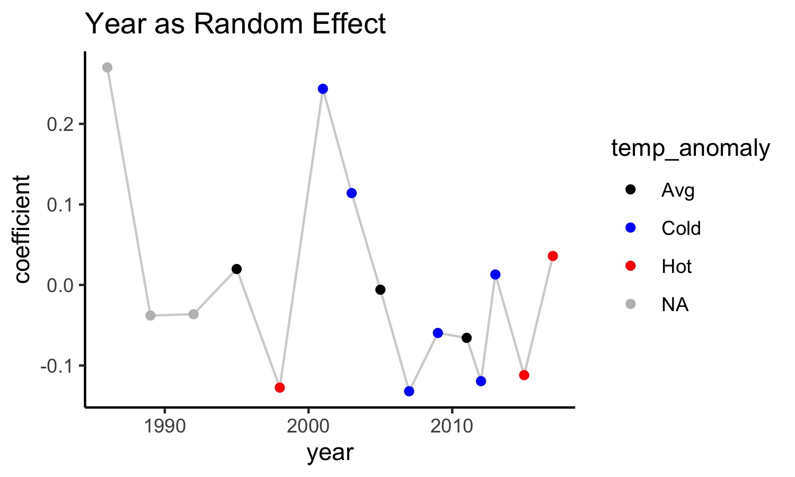

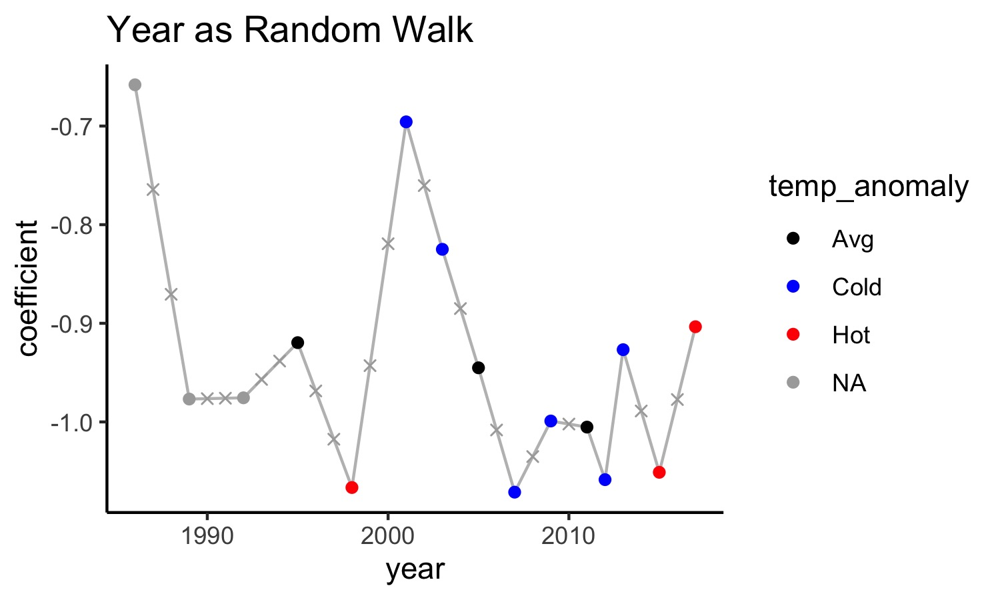

Between the five different models - `s(age)`, `s(age) + s(cohort)`,
`s(age) + (1 | cohort)`, `s(age) + (1 | year)`, and
`s(age) + rw(year)` - The `s(age) + (1 | cohort)` model was the best fit
(\>2000) followed by `s(age) + rw(year)`, `s(age) + (1 | year)`,
`s(age) + s(cohort)`, and `s(age)`.

**Adding spatial and spatiotemporal random effects**

Since I have identified `s(age) + (1 | cohort)` as the best supported model, I will add spatial and spatiotemporal random effects

1.  `s(age) + (1 | cohort)`
2.  `s(age) + (1 | cohort) +` $\omega_s$
3.  `s(age) + (1 | cohort) +` $\epsilon_{s,t}$
4.  `s(age) + (1 | cohort) +` $\omega_s$ + $\epsilon_{s,t}$

For the spatiotemporal models, I tested both IID and AR1 processes. Of these models, the model with spatial and spatiotemporal (AR1) random effects was the best fitting model. 

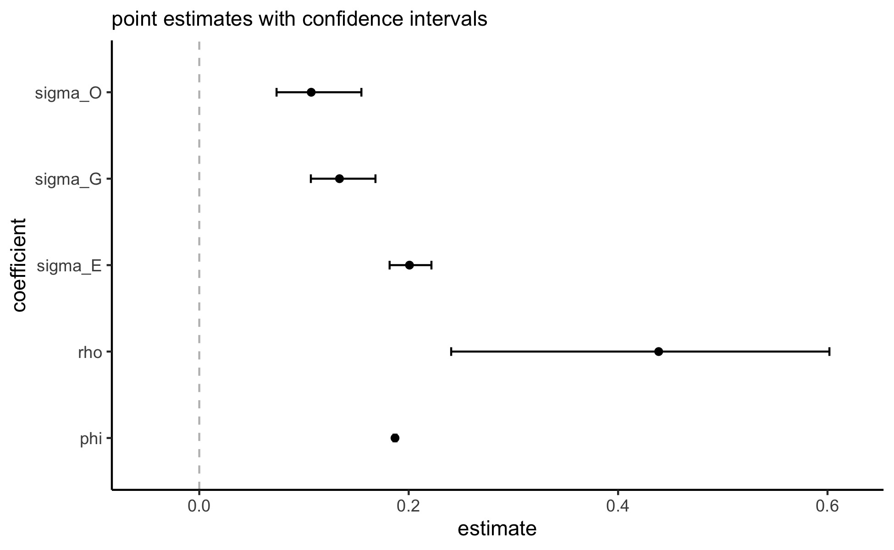


