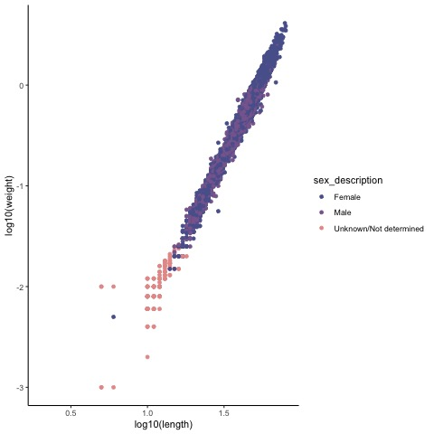
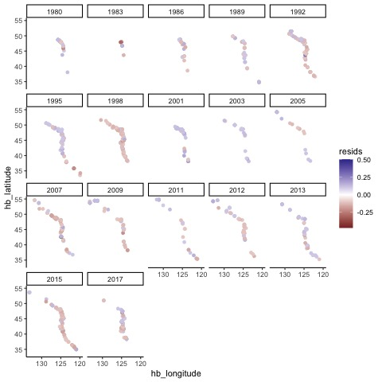

### June 27 - July 1, 2022

Received acoustic-trawl survey data through NOAA data warehouse - 103,245 observations. Data for 1980 - 2017 are included. I began by creating a new dataset, `hake_df` that included only Pacific Hake observations and relevant information (columns) - 93,186 observations. Date information from the `eq_date` column were used, however, observations with missing years were filled in using information from `hb_date` column. This constituted only observations from year 2017.


There are 46,816 female observations and 44,982 male observations. There seems to be a fairly equivalent number of males vs females.



Looking more closely at growth, particularly the relationship between length and weight, much of the unknown sex descriptions come from smaller sized fish which makes sense. Females and Males seem to follow very similar growth trends, as indicated by fitting separate growth models to each sex and estimated coefficients being fairly similar. Visually, there seems to be a greater abundance of females at those larger sizes.

Because of the similarity between males and females and because males and females are not modeled explicitly in the stock assessment, I went ahead and continued modeling the sexes aggregated together. I did this by first subsetting `hake_df` to observations that had complete length and weight information `fit_hake_df` - 52,382 observations. I log10-transformed the data (this was recommended over natural log transformation), and fit a linear model using `lm()`, a least squares method. The resulting model then became $$log_{10}(W) = log_{10}(a) + b*log_{10}(L)$$.


Above is the fitted model over the raw data and a plot of the residuals. The multuple R-squared value of the fit is 0.9819, which means that 98% of the variability can be explained by the model - which is great!

From now, I will be referring to residuals as growth anomalies (... makes more sense in my brain). These next few plots will be exploring patterns in growth anomalies as it relates to time, location, and age.


This first graph shows the variability in growth anomalies per year. Immediately, you notice that 1995, 2007, and 2017 have considerable variability in growth anomalies between individuals (i.e. there is a wide distribution of individuals who are both larger and smaller than normal). The distribution in 2007 is largely driven by 3 outliers, where those outliers are small (length) individuals that are much heavier (weight) than normal. I believe this may be due to measurement error. Years 1995 and 2017 are years adjacent to record warm years (marine heatwaves) which may have led to this variability in growth anomalies due to differential responses between fish (spatial or perhaps age?).


This plot removes the outliers from 2007. You can see that the 3 outliers really drive the distribution - how should we handle these outliers?


This plot is looking at the average growth anomalies per year without the spread of data. It looks like many of the years prior to 2003 were dominated by larger-than-avg individuals, except the year in which a marine heatwave occured. Following 2003, many of the years are dominated by smaller-than-avg individuals with the exception of 2013 and 2017.



This graph shows how growth anomalies vary along the west coast every year. Values close to 0 (i.e. observed value is close to predicted - no anomaly) are transparent for better visualization of + and - values. Moreover, those 3 outliers in 2007 are included in the graph, but not in the color scale limit, for improved visualization. You can see there is considerable year-to-year variation, where in 1998 and 2015 you see mostly smaller-than-avg fish all along the coast and aligns with the years with marine heatwaves. In some years, there seems to be a slight stratification, where the northern half of the coast shows larger or smaller-than-avg individuals and southern half vice versa. An issue with this graph is that you can't see individuals who do not exhibit a growth anomaly, which I think would be valuable to see if this occurs in a part of the coast.


A time series of average growth anomalies per age group. This essentially reveals how variable growth anomalies are per age - are some ages more vulnerable to variation in growth? are some age classes consistently larger or smaller than average? Either way, this plot is a little hard to decipher.


Summarizing the variability of growth anomalies per age even further, we can see that growth anomalies are most variable at age 0 - likely because there's fewer data and potentially greater measurement error - and that variability in growth anomalies increases slightly with age. However, there are fewer observations at those older age classes. I plan to create a plus group, by concatenating the age classes 15+ as done similarly in the stock assessment.

### July 4-8, 2022

Some next steps I plan to take this week is I will fit an age at length model to assign ages that don't have values. I will create a plus group age, grouping all ages 15 and greater. What sort of changes do we see when we make this assumption? I will explore finer temporal resolution to hopefully get an idea of some of the sampling/selectivity bias that might be happening. Another question was whether there was spatial variation in which sex dominates? All of this should then lead to some statistical modeling to determine relative importance of the patterns that I am seeing.

Okay, to start with estimating age using an length-at-age model, I first subsetted the `hake_df` dataframe so that there is only complete cases for age and length columns named `age_hake_df`. Then I added a new column `new_age` which were ages including plus group (ages 15+)

I first fit a Von Bertalanffy model to the whole data (all years combined), then fit a Von Bertalanffy model assuming "two regimes" where I fit the model to years 1980-2003 and 2004-2017, and finally I fit a Von Bertalanffy model to the plus group data. $size \sim L_{\infty}/(1 + exp(-K * (age - t_0)))$

I selected the regimes by visually determining years with the most similar average growth anomalies (1980-2003 had larger-than-avg individuals and 2004-2017 had smaller-than-avg).

There was negligible differences in fit and coefficients between the whole data scenario (RSS = 551852) and the plus group scenario (RSS = 551912). However, when the data was split into regimes the fit of the model improved as indicated by the Residual Sum Squares (RSS = 324002/200280).

Overall, the fits didn't look so great - there was a bit of underfitting over the age of 6. The graph below only shows fit for the whole data, however, there were


Because I created a plus group, I wanted to go back and look at some of the data visualizations I did last week to see if there were any big changes.

First, I looked at the variability in growth anomalies per age by plotting the residual standard deviation for each age. The size and color of the points indicate number of observations and whether the residuals are positive on average (i.e. larger-than average), respectively.


When estimating ages, it's worth making sure I understand what ages we are estimating. Below is a rough length frequency plot by age, where colors indicate age, and the grey line indicates observations that haven't been assigned an age. A lot of the observations with unassigned ages are larger individuals, and the VB models I have explored so far underestimate the ages of those larger indivudals. How should I proceed?


Looks like age 6+ are fairly similar lengths - increased potential for mis-assigning these ages?

In terms of the stock assessment, the 2006 assessment modeled growth 3 ways: time-varying K, density dependent growth, and cohort-specific K.


Notes from meeting with Kristin 7/7/22

-   The weight/age/year data may not be considered confidential and could request to get that data.
-   Interesting to look at spatial and temporal variation (check Maia Kapur's work).
-   Potential big-picture questions
    -   How can we leverage this information of growth anomalies? Are there cohort effects? Is there an effect on future spawning?
    -   Are there bigger recruitment events in years with fatter fish?
    -   Do fish that are fatter in the early lie stages, stay fatter throughout their life?
    -   Ultimately, how can we develop a model that goes into the MSE?
-   Next steps:
    -   Still have to explore finer temporal resolution
    -   hierarchical or mixed growth model with time varying K

### July 11-15, 2022

-   Meeting with Kelli Johnson (7/14/22) on weight at age
    -   weighting process
        -   summarizes the data and then use that to weight things
        -   assumes all fish of the same age have the same weight
        -   only use individuals with ages when working with age composition and weight at age
        -   use individuals with length, weight, and age to groundtruth if needed
    -   data_wtatage()
        -   needs maturity ogive and catches to get mean weight at age. uses previous years to fill in missing age information
        -   assumes every population process going through SS uses the same weight at age (between different data sources - fishery vs survey vs etc)
        -   sampling date as potential covariates (do we need to take into account sampling month when we do weighting?)
        -   could model season (season just means month) but the caveat is that we need to fill in everything, and so that's just more estimating ages
        -   if the estimated ages look the same regardless if we add biological realism then who cares
        -   female only modeled
        -   ignoring this dilutes the potential that surveys/data sources are sampling different fish
        -   may need some way to fill in missing information better based on the results that we (kristin and i) find
            -   what if there's a regime shift but we don't account for that
            -   are there environmental covariates that may drive changes in weight at age?
        -   SS there's flexibility in how you want to fill in these values
        -   factors influencing weight at age
            -   sampling bias
            -   cohort effects
            -   environmental effects
        -   check how Pollock assessment fills in missing information
        -   Sablefish also has a lot of data to test on
        -   visualize weight at age over the raw data to see if there are strong cohorts coming through
        -   Line 157 in github code - beginning of where they fill in missing values
-   Meeting with Kristin
    -   random effects
        -   year
        -   cohort
        -   to establish cohort, we can create a cohort ID that is their birth year (cohort ID = current year - age) - We could also look at how growth anomalies relate to the size of the population or cohort to get into some density dependence effects
    -   3 potential ways to model weight at age
        -   random effect just on age
        -   gam (does brms have gams)
        -   boosted regression trees
            -   Doesn't give insight into mechanism, so might be difficult to translate into something for MSE
    -   For the growth anomaly variability line graph, we could also look at
        -   ages 1 and 2
        -   immature vs mature fish
        -   To think about: age 3 fish have fairly variable growth anomalies and they are also the biggest contributor to recruitment
            -   how does this variability affect population dynamics
    -   Note: big cohorts happened in 1999 and 2010

I tested out different GAMs using `gam()`, as well as running it in `brms`.

1.  Simple GAM with no random effects

```{r, eval = FALSE}
gam_out <- gam(weight ~ s(new_age), data = hake_weight_age_df, method = "REML")
```

2.  GAM with group-level smoothers with different wiggliness for year

```{r, eval = FALSE}
gamm_out = gam(weight ~ s(new_age, bs="tp") +
      s(new_age, by = catch_year, m = 1, bs="tp") +
      s(catch_year, bs="re"), 
      data = hake_weight_age_df, method="REML")
```

3.  GAM with group-level smoothers with same wiggliness for year

```{r, eval = FALSE}
gamm_GS_out = gam(weight ~ s(new_age, m = 2) +
                 s(new_age, catch_year, bs="fs", m = 2), 
               data = hake_weight_age_df, method="REML")
```


4.  GAM with group-level smoothers with different wiggliness for cohort

```{r, eval = FALSE}
gamm_cohort_out = gam(weight ~ s(new_age, bs="tp") +
                        s(new_age, by = cohort, m = 1, bs="tp") +
                        s(cohort, bs="re"), 
                      data = hake_weight_age_df, method="REML")
```

5.  GAM with group-level smoothers with same wiggliness for cohort

```{r, eval = FALSE}
gamm_GS_cohort_out = gam(weight ~ s(new_age, m = 2) +
                    s(new_age, cohort, bs="fs", m = 2), 
                  data = hake_weight_age_df, method="REML")
```


Of all 5 models, `gamm_GS_cohort_out` had the smallest AIC value. 

- Notes on weight-length and weight-at-age and how they may relate   
    - weight-length relationships are indicative of "body condition"
    - weight-at-age is a rate, so potentially indicative of growth rate


